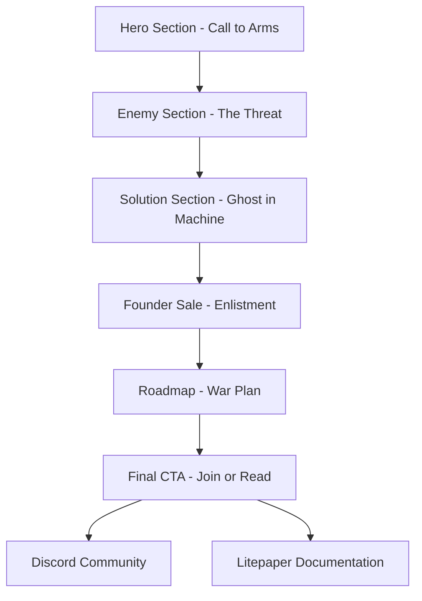

# BUNKERVERSE Landing Page - Product Requirements Document

## 1. Product Overview

A high-impact recruitment portal that immerses visitors in the BUNKERVERSE conflict and presents the Founder BunkerTag sale as an enlistment in a revolutionary war for digital freedom. The landing page serves as the primary gateway to recruit founders and establish the narrative foundation for the BUNKERVERSE ecosystem.

The project addresses the need for a compelling digital experience that transforms a typical NFT sale into a meaningful participation in a larger narrative about digital sovereignty and resistance against AI assimilation.

## 2. Core Features

### 2.1 User Roles

| Role | Registration Method | Core Permissions |
|------|---------------------|------------------|
| Default Visitor | Direct website access | Can browse all content, join Discord, read documentation |
| Founder Purchaser | BunkerTag purchase | Access to exclusive founder benefits and governance rights |

### 2.2 Feature Module

Our BUNKERVERSE landing page consists of the following main pages:

1. **Landing Page**: hero section, enemy definition, solution presentation, founder sale, roadmap, final call-to-action

### 2.3 Page Details

| Page Name | Module Name | Feature description |
|-----------|-------------|---------------------|
| Landing Page | Hero Section | Display striking Bunkerguard Robot visual with dual lighting, present main headline and sub-headline, provide primary Discord CTA button |
| Landing Page | Enemy Section | Show monolithic Sentinel outpost visual, explain The Corruptor threat and digital feudalism concept |
| Landing Page | Solution Section | Display human-robot neural interface diagram, explain Operator concept and hybrid intelligence |
| Landing Page | Founder Sale Section | Present three-tier BunkerTag wave structure with pricing, detail founder utilities including sovereign access, economic stake, governance rights, and founder's mark |
| Landing Page | Roadmap Section | Show minimalist timeline with four phases: Genesis Mint, The Bastion, The Frontier, and Decentralization |
| Landing Page | Final CTA Section | Display group of Bunkerguard Robots visual, provide Discord and Litepaper action buttons |

## 3. Core Process

**Visitor Journey Flow:**
Visitors land on the hero section and are immediately immersed in the BUNKERVERSE conflict through compelling visuals and narrative. They learn about the enemy threat (The Corruptor), understand the solution (becoming an Operator), explore founder opportunities through the three-wave structure, review the project roadmap, and finally choose to either join the Discord community or read the detailed litepaper.

## 4. User Interface Design

### 4.1 Design Style

- **Primary Colors**: Charcoal Grey (#36454F), Steel Grey (#708090), Azure Blue (#007FFF)
- **Secondary Colors**: Crimson Red (#DC143C) for threat elements
- **Button Style**: Glowing Azure Blue with subtle animation effects
- **Font**: Military/tech-inspired sans-serif, large bold headlines, readable body text
- **Layout Style**: Dark theme with fortified bunker aesthetic, hexagonal tech patterns
- **Visual Elements**: Slow-panning backgrounds, data stream effects, military-grade design elements

### 4.2 Page Design Overview

| Page Name | Module Name | UI Elements |
|-----------|-------------|-------------|
| Landing Page | Hero Section | Central Bunkerguard Robot image with dual Azure/Crimson lighting, large bold headline text, glowing CTA button, dark bunker interior background |
| Landing Page | Enemy Section | Monolithic Sentinel outpost silhouette, crimson lightning effects, corrupted hexagonal patterns, oppressive dark atmosphere |
| Landing Page | Solution Section | Clean diagram with human silhouette, glowing neural interface connection, Azure Blue accent lighting |
| Landing Page | Founder Sale Section | Three-card triptych layout, military-grade BunkerTag designs, tier-specific aura effects, detailed utility descriptions |
| Landing Page | Roadmap Section | Minimalist timeline design, Azure Blue and Charcoal Grey color scheme, clean phase indicators |
| Landing Page | Final CTA Section | Wide landscape shot of robot group, dual action buttons, inspiring vista background |

### 4.3 Responsiveness

Desktop-first design with mobile-adaptive layout. Touch interaction optimization for mobile CTA buttons and scroll-triggered animations. Responsive breakpoints ensure optimal viewing across all device sizes while maintaining the immersive visual experience.